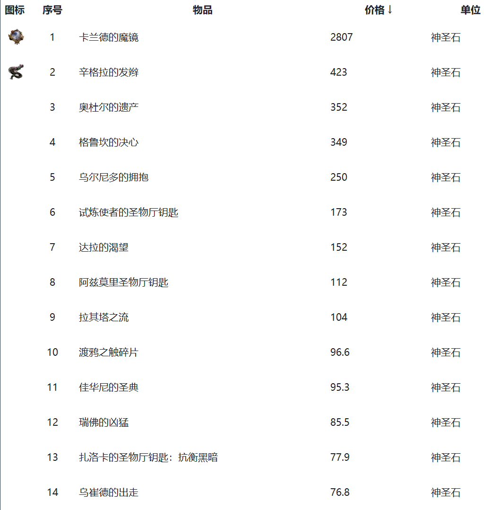
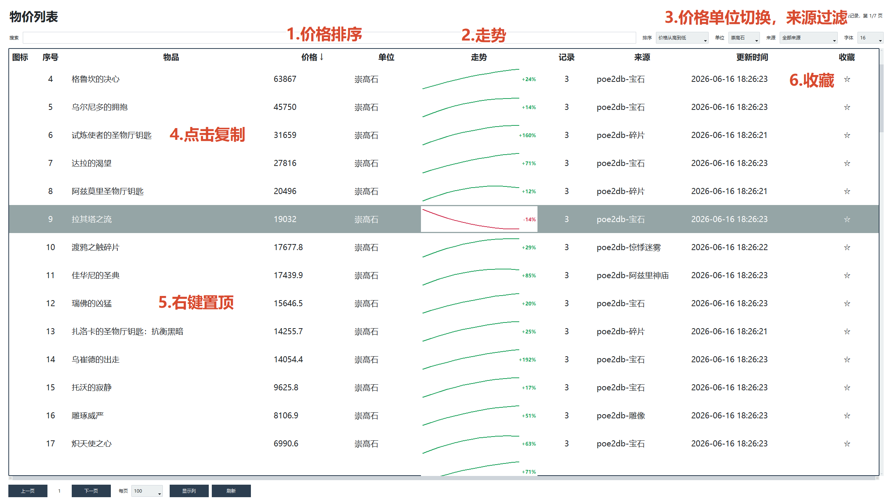
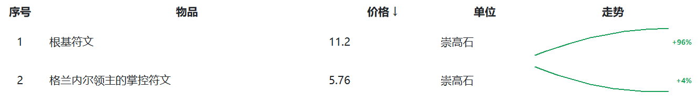
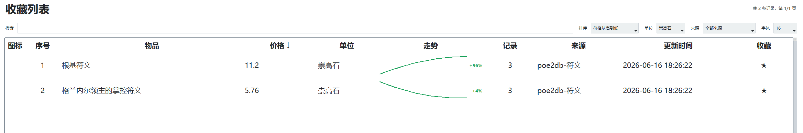
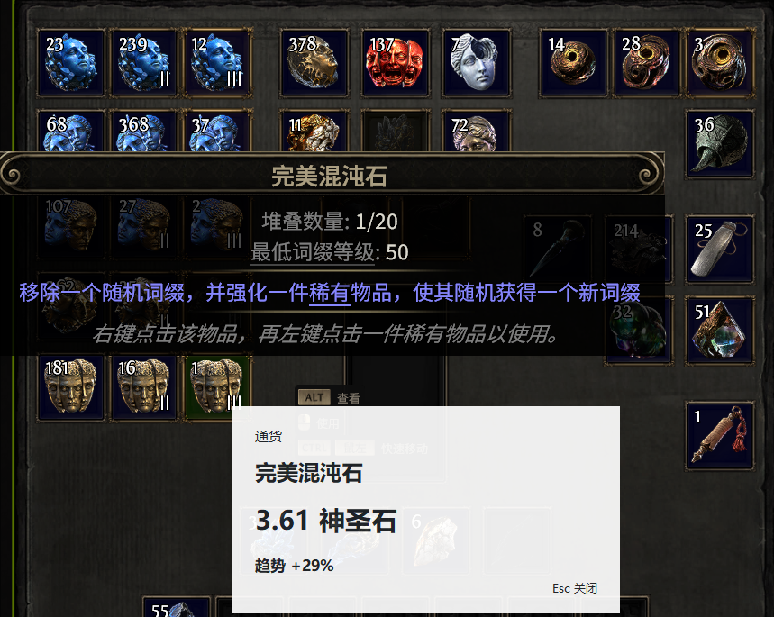
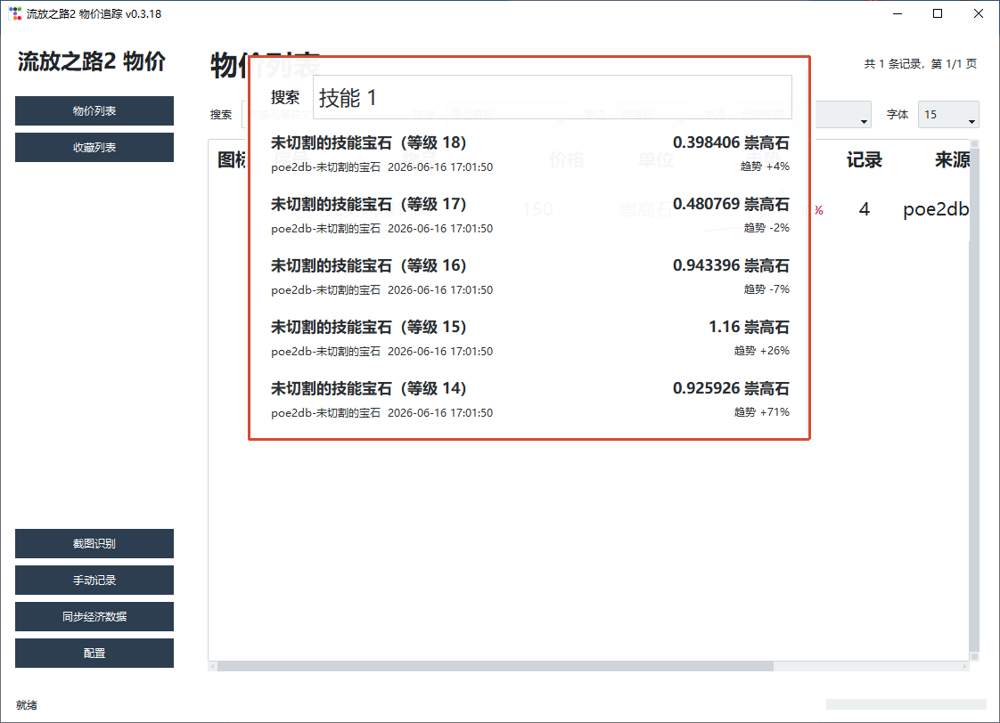
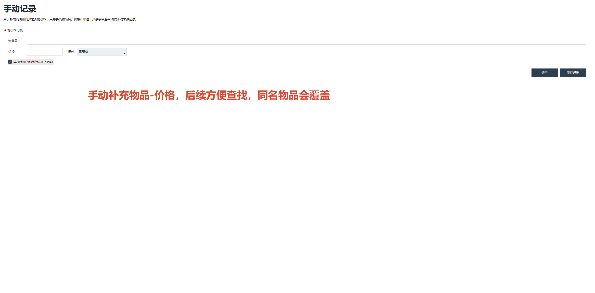
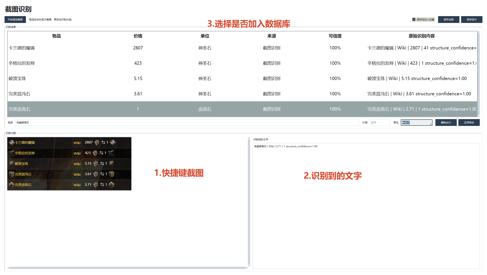
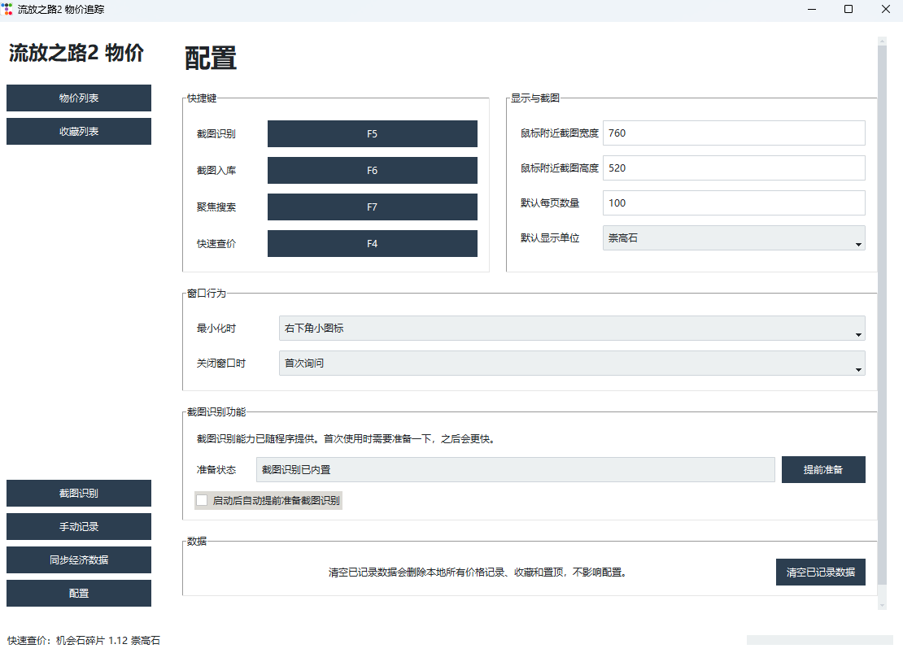
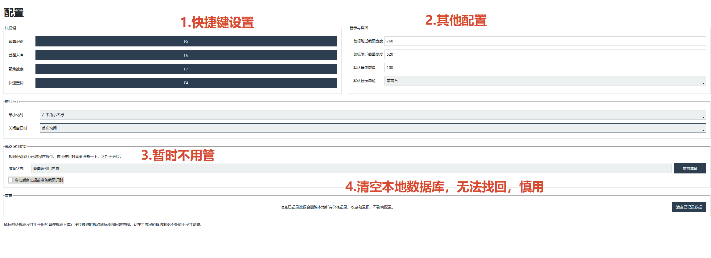

# 流放之路2 物价追踪器

一个 Windows 本地版 POE2 查价器，主要面向国服玩家，用来快速查询、记录和关注通货类物品价格。

价格数据目前主要来源于流亡2编年史的经济页：

https://poe2db.tw/cn/Economy

因此，本软件当前更适合作为国服 POE2 的价格参考工具，用来快速对比、锚定通货价格。软件由个人兴趣开发，难免存在 bug，欢迎反馈。

## 主要用途

- 快速了解通货物价
- 收藏并关注自己关心的物品
- 在游戏内通过快捷键快速查询通货价格
- 维护自己的本地价格记录
- 对比 poe2db 经济数据，辅助判断刷图收益

它主要解决几个问题：

- 通货种类较多，刷图时很难快速判断价格
- 常规查价工具可能需要登录、联网查询，操作链路较长
- 每个人关注的通货和物品不同，需要一个自己的轻量价格库

## 功能介绍

### 物价列表

软件的核心页面，用于查看已同步或已记录的物价数据。

支持：

- 按物品名搜索
- 空格分隔多个关键词搜索，例如 `空白 预兆`
- 按名称、价格、单位、来源、更新时间等列排序
- 切换显示单位
- 查看简化趋势
- 收藏或取消收藏物品

走势说明：

- 有 2 条以上本地历史记录时，百分比按最近历史记录计算
- 有 3 条以上本地历史记录时，才绘制走势图
- 如果历史记录中存在不同单位，会先按当前汇率换算到该物品最新记录的单位
- 百分比 = `(最新价格 - 这段历史的最早价格) / 这段历史的最早价格`
- 曲线只表示这段历史中的相对高低，不表示绝对价格刻度
- 只有 1 条本地记录时，不绘制曲线；如果同步数据中带有 poe2db 趋势百分比，则只显示该百分比作为参考

### 收藏列表

用于维护自己的关注列表。基本功能和物价列表一致，适合把常看的通货、符文、预兆等物品单独放在一起。

### 快速查价

默认快捷键为 `F4`。

在游戏中悬停物品后使用游戏复制信息，再通过本软件查询本地数据库，并显示一个悬浮查价窗口。适合快速查看通货、碎片等已有价格记录的物品。

### 焦点搜索

默认快捷键为 `Ctrl+Space`。

可以快速唤出一个简洁搜索框，输入物品名后显示前几条匹配价格。再次按快捷键或按 `Esc` 可关闭。

### 手动记录

可以手动输入物品名称、价格和单位，写入本地数据库。适合记录自己交易、观察到的价格，或补充当前数据库没有的数据。

### 同步经济数据

可以从 poe2db 经济页同步价格数据：

https://poe2db.tw/cn/Economy

同步限制为每 30 分钟最多一次，避免频繁请求。同步后的结果会进入本地数据库，并显示在物价列表中。

### 截图识别

截图识别可通过快捷键进入框选模式，框选后自动识别截图中的物品名，并在本地价格库中匹配价格列表。

0.3.20 对截图链路做了重点优化：

- 按截图快捷键后更快进入框选模式
- 同一时间只允许一个截图任务，避免连续按快捷键导致操作堆叠
- 截图确认后在后台执行 OCR，减少主界面和游戏卡顿
- 截图查价结果窗口会自动获得焦点，可直接按 `Esc` 关闭
- 可在配置中关闭“在截图识别页显示截图、识别文字和可保存列表”，只保留查价浮窗结果

当前方向包括：

- 识别截图结构
- 划分物品名、价格、单位区域
- 结合内置通货图标推断单位
- 将识别结果确认后写入本地数据库

#### OCR 性能设置

截图识别依赖本地 OCR 推理。配置页提供以下选项：

- `OCR推理后端`：默认为 `自动`。自动模式会优先使用本机可用的 GPU 后端，未检测到可用 GPU 后端时回退到 CPU
- `OCR CPU线程`：默认自动检测本机逻辑核心数，并保留一部分系统资源，避免 OCR 推理把 CPU 占满影响游戏
- `启动后自动提前准备截图识别`：开启后会在程序启动后提前加载 OCR，首次截图时等待更少
- `在截图识别页显示截图、识别文字和可保存列表`：关闭后，截图查价仍会正常显示结果浮窗，但不会在截图识别页展示详细过程

## 界面预览

### 物价列表

物价列表是软件的主页面，适合查看、搜索、排序和收藏同步后的价格数据。



物价列表支持按列排序、走势查看、来源筛选、分页和收藏操作。



### 收藏列表

收藏列表用于集中查看自己重点关注的物品。





### 游戏内快速查价

在游戏中复制物品信息后，可以通过快捷键查询本地价格，并显示悬浮查价窗口。



### 焦点搜索

焦点搜索用于快速输入关键词并查看前几条匹配结果，适合在不切换主界面的情况下查价。



### 手动记录

手动记录适合补充自己观察到的价格，或记录暂时没有同步到的数据。



### 截图识别

截图识别页面用于选择截图区域、查看识别过程，并确认识别出的物品、价格和单位。



### 配置

配置页用于调整快捷键、窗口行为、显示效果、OCR 相关选项和本地数据维护功能。





## 下载

最新版可在 GitHub Release 页面下载：

https://github.com/bigdogaaa/PoE2PriceTracker/releases/latest

当前版本：`0.4.9`

如果你只是使用软件，下载 release 中的 `PoE2PriceTracker-0.4.9.exe` 即可。

## 更新源

默认使用 Gitee 仓库保存 `latest.json`，只承担版本检查流量：

```text
https://gitee.com/BiGDoGaaa/poe2pricetracker_version_info/raw/master/latest.json
```

软件本体仍发布到 GitHub Release，作为自动更新下载源；为了提升手动下载稳定性，手动下载入口迁移到夸克网盘，链接会写入 `manual_urls`。

`latest.json` 示例：

```json
{
  "version": "0.4.9",
  "channel": "stable",
  "url": "https://github.com/bigdogaaa/PoE2PriceTracker/releases/download/v0.4.9/PoE2PriceTracker-0.4.9.exe",
  "download_url": "https://github.com/bigdogaaa/PoE2PriceTracker/releases/download/v0.4.9/PoE2PriceTracker-0.4.9.exe",
  "manual_urls": ["https://pan.quark.cn/s/xxxx"],
  "sha256": "...",
  "size": 105518264,
  "release_date": "2026-06-19",
  "notes": ["更新说明"],
  "mandatory": false
}
```

统一发布脚本会更新 GitHub Release、把 `latest.json` 写到 Gitee，并把夸克链接写入 `manual_urls`：

```powershell
$env:GITHUB_TOKEN="你的 GitHub token"
$env:GITEE_TOKEN="你的 Gitee token"
python scripts\publish_release_channels.py --version 0.4.9 --asset dist\PoE2PriceTracker-0.4.9.exe --quark-url "https://pan.quark.cn/s/xxxx" --notes "更新说明"
```

客户端默认读取 Gitee `latest.json`；如果检测到新版本，自动下载走 GitHub，手动下载按钮打开夸克链接。

## 数据说明

软件数据默认保存在：

```text
%LOCALAPPDATA%\PoE2PriceTracker
```

其中包括：

- `prices.sqlite3`：本地价格数据库
- `config.json`：软件配置
- `screenshots\`：截图缓存

你可以在配置页清空已记录数据。清空数据不会删除软件本身。

## 后续 RoadMap

计划加入或继续优化：

- 更多可查价物品类别
- 基底类装备价格参考
- 游戏内截图识别
- 快捷键查价体验
- 价格共享功能

价格共享的设想是：用户可以主动上传自己查到的“物品-价格”记录，形成一个可共享的参考价格库。

## 反馈

作者：大狗狗丶丶

如果遇到问题，可以在踩蘑菇搜索同名账号留言反馈。

## 版权说明与免责声明

本软件【流放之路2 物价追踪器】由【大狗狗丶丶】开发并发布。软件中由开发者原创的程序代码、界面设计、文档说明、配置文件及相关资源，除另有说明外，其著作权及相关权益归【大狗狗丶丶】所有。

未经版权所有者书面许可，任何个人或组织不得将本软件用于商业转售、恶意传播、二次打包、冒名发布、破解篡改、去除版权标识或其他侵犯开发者合法权益的行为。

本软件可能涉及的游戏名称、图标、截图、道具名称、文本数据、商标、素材或其他相关内容，其版权、商标权及相关权益均归原游戏厂商或相应权利人所有。本软件与相关游戏厂商、发行商或平台方不存在任何官方隶属、合作、授权、赞助或背书关系，除非另有明确书面说明。

本软件仅供学习、研究、技术交流及个人辅助分析使用，旨在帮助用户理解数据处理、文本识别、信息整理、游戏数据分析等相关技术原理。

用户在使用本软件时，应遵守所在地区的法律法规、游戏平台规则、游戏用户协议、社区规范及相关服务条款。用户不得将本软件用于破坏游戏公平性、绕过安全机制、自动化作弊、非法牟利、攻击服务器、侵犯他人权益或其他不当用途。

本软件按“现状”提供，开发者不对软件的适用性、稳定性、准确性、完整性、及时性或无错误运行作任何明示或默示保证。

用户因下载、安装、运行、修改、传播或使用本软件而产生的任何风险，包括但不限于账号限制、数据丢失、系统异常、软件冲突、游戏体验受影响、第三方平台处罚或其他直接、间接损失，均由用户自行承担。

本软件不会主动鼓励、支持或引导用户违反任何游戏服务条款或平台规则。若用户将本软件用于违反法律法规、平台规则或游戏用户协议的行为，由此产生的一切责任均由用户自行承担，与开发者无关。

若本软件的任何内容无意中侵犯了相关权利人的合法权益，请通过踩蘑菇账号联系作者。经核实后，将及时进行修改、删除或其他合理处理。

用户下载、安装、运行或使用本软件，即视为已经阅读、理解并同意本版权说明与免责声明的全部内容。若用户不同意本声明中的任何条款，请立即停止使用并删除本软件。

## 隐私与数据说明

本软件在运行过程中，可能会根据功能需要读取用户主动提供或本地环境中可访问的信息，包括但不限于剪贴板文本、用户导入的配置文件、游戏内复制文本、本地缓存数据、软件运行日志及用户手动填写的自定义数据。

除非软件功能明确说明并经用户主动触发，本软件不会主动收集、上传、出售、共享或公开用户的账号信息、密码、聊天记录、个人身份信息、支付信息、设备敏感信息或其他私人数据。

若本软件提供云同步、数据备份、错误反馈、版本检查、统计分析或类似联网功能，相关数据仅用于实现对应功能、改进软件体验、排查错误或维护服务稳定性。

用户应自行妥善保管账号、密码、令牌、配置文件、个人数据及其他敏感信息。因用户主动公开、错误配置、将敏感信息粘贴到软件中、使用非官方版本、第三方篡改版本或在不安全环境下运行本软件而造成的数据泄露、账号风险或其他损失，由用户自行承担。

若用户希望删除本软件产生的本地数据，可通过软件设置、清理缓存、删除配置文件或卸载软件等方式处理。

## 更新说明

### 2026-06-19 v0.4.9

- 修复检查更新可能卡在“正在检查”的问题，并按顺序使用首个可用更新源。
- 优化本地查价、趋势和实时价格读取性能，降低快捷查询等待时间。
- 优化截图查价结果窗口布局，结果较少时显示更紧凑。
- 统一 F1、F4、F6 查询结果中的价格、趋势、时间和点赞显示。

### 2026-06-19 v0.4.8

- 修复 F4 快速查价卡片中实时价格点赞控件只显示数字、不显示点赞图标的问题。

### 2026-06-19 v0.4.7

- 主窗口启动时先完成布局再按当前屏幕工作区居中显示，避免初始窗口偏移。
- 更新地址列表恢复一行一个的形式：Gitee 固定在首行且不可删除，GitHub 作为默认可删除的备用版本清单源。
- 修复检查更新后底部状态条停留在“正在检查更新...”的问题。
- 重做 F4 快速查价浮窗定位：按下 F4 时记录 Windows 屏幕坐标，浮窗使用 Win32 绝对定位固定到该位置，避免在游戏和软件前台之间漂移。

### 2026-06-19 v0.4.6

- 配置页“软件更新”区域明确展示内置 Gitee 版本检查地址和 GitHub 自动下载地址，额外地址列表只作为备用版本清单源。
- 修复 F4 快速查价趋势在历史价格混用神圣石、崇高石、混沌石时可能计算错误的问题。
- 优化启动位置、启动更新弹窗和更新提示链接，启动后自动检查更新时弹窗居中显示。

### 2026-06-19 v0.4.5

- 内置 Gitee 版本检查源，配置页更新地址只保留额外备用源；旧的显式 Gitee、七牛、旧 GitHub 等无效地址会自动清理。
- 左侧同步菜单恢复普通按钮样式，说明改为鼠标悬停提示，并补充同步时间限制。
- 进一步修复 F4 快速查价浮窗定位：按下快捷键时立即记录鼠标位置，避免复制和查价过程中的偶发坐标异常导致窗口落到左上角。

### 2026-06-19 v0.4.4

- 左侧菜单恢复简洁样式，不再显示版本状态。
- 为“同步实时价格”和“同步经济数据”增加简明说明入口，便于区分两类同步数据的用途。
- Ctrl+Space 快速搜索框新增简洁的物价单位切换，便于临时按神圣石、崇高石或混沌石查看价格。
- 修复 F4 快速查价浮窗在游戏焦点或多显示器环境下可能跑到左上角的问题。
- 强化旧更新源迁移逻辑，自动清理七牛、旧 GitHub、旧 Gitee 发布仓库和非标准 Gitee 版本清单地址。

### 2026-06-19 v0.4.2

- 新增自动更新能力，当前使用 Gitee 保存版本检查清单，GitHub Release 保存软件本体，夸克网盘作为手动下载入口。
- 配置页新增可排序更新地址列表和启动后自动检查更新开关，更新清单支持 UTF-8 BOM、SHA256 与大小校验。
- 左上版本号后新增更新状态提示：检查中、有更新、最新版或检查失败。
- 优化实时价格同步：本地按页增量处理远端数据，跳过未变化记录，减少 Redis/本地数据库读写并降低单次同步失败风险。
- 实时价格导入确认框支持对已有历史实时价格直接点赞，价格对比单位会跟随截图识别到的基础通货单位。
- 基础通货互查改为读取最新有效两两兑换比例，支持神圣石、混沌石、崇高石之间的正向和反向报价。
- 修复 F4 快速查价卡片中点赞票数出现在趋势下方、看起来像多余数字的显示问题。

### 2026-06-18 v0.4.1

- 切换默认价格共享服务地址到 `http://117.50.51.78:8787`，并完成新服务器部署与连通性验证
- 修复基础通货实时导入覆盖问题：神圣石、混沌石、崇高石之间的兑换会按稳定优先级落库，避免同一汇率分散到不同物品行
- 优化基础通货汇率读取：实时导入的最新有效基础通货报价会覆盖旧 poe2db 报价，并过滤明显异常的神圣石/崇高石比例
- 调整物价走势曲线数据源：有有效实时价格时只使用实时价格历史绘制，完全没有有效实时价格时再回退到 poe2db/普通历史
- 优化实时价格导入确认框：价格比例不可手动改写，只允许修正物品名和买入/卖出方向，并在价格栏右侧显示原始比例

### 2026-06-18 v0.4.0

- 新增实时价格共享链路：实时价格导入记录可同步到共享服务，并支持本地同步其他用户提交的实时价格
- 新增实时价格评价机制：点赞绑定到单条实时价格记录，可通过最低赞数阈值过滤可信结果
- 查询逻辑优化：同一物品存在满足阈值的实时价格时，优先展示实时价格；没有有效实时价格时再回退到 poe2db 或手动记录
- 优化实时价格导入浮窗，修复底部文字显示不全和下拉框视觉溢出问题
- 服务端增强：共享服务改为服务器代理 Redis 密钥，补充访问/提交日志，并支持自动重启

### 2026-06-17 v0.3.21

- 调整物价列表走势口径：百分比优先使用本地历史首尾价格计算
- 本地历史满 3 条记录时才绘制走势图，历史点数不足时只显示百分比
- 历史记录存在不同单位时，会先换算到该物品最新记录的单位再计算走势
- 优化走势列绘制边界，避免曲线或百分比溢出表格单元格
- 修复物价列表底部趋势图覆盖横向滚动条的问题

### 2026-06-17 v0.3.20

- 优化截图快捷键响应速度，减少进入框选模式前的等待
- 优化截图确认后的 OCR 处理流程，降低主界面卡顿和游戏卡顿感
- 修复连续按截图快捷键会堆叠多个截图操作的问题
- 截图查价结果窗口出现后自动获得焦点，支持直接按 `Esc` 关闭
- 新增 OCR 性能配置：推理后端默认为 `自动`，可选择 `CPU`、`GPU DirectML` 或 `GPU CUDA`
- 新增 OCR CPU 线程下拉配置，默认按本机逻辑核心数自动分配资源
- 修复“在截图识别页显示截图、识别文字和可保存列表”关闭后未生效的问题
- 优化打包流程：默认生成单文件 exe，文件名带版本号，并替换为新版圆角应用图标

### 2026-06-17 v0.3.19

- 新增实时截图查价：框选截图后自动识别物品并显示价格列表
- 优化截图识别页，可按需显示或隐藏识别详情
- 新增截图缓存数量设置，默认只保留最近 20 张
- 收紧物品匹配规则，减少误识别结果

### 2026-06-17

- 新增焦点搜索及相关配置，默认使用 `Ctrl+Space` 唤出或关闭
- 新增配置页退出按钮
- 优化快速查询、搜索框显示和 release 发布流程
- 新版放在 GitHub Release 附件中
